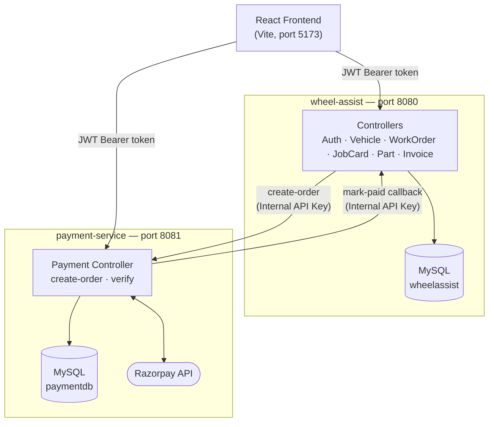
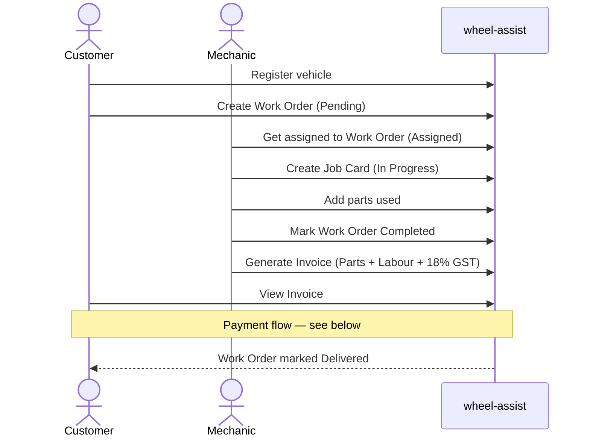
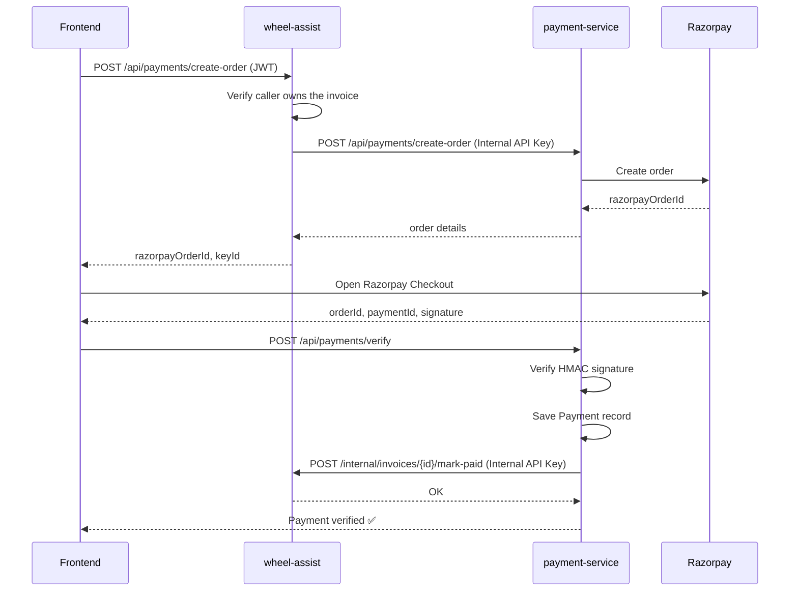

# 🔧 WheelAssist

**A web-based vehicle service management platform** that streamlines the entire repair workflow — from customer booking to mechanic job cards to online invoice payment.

> Customers register vehicles and raise service requests. Mechanics pick up jobs, log parts used, and generate invoices. Payments are processed online via Razorpay, with automatic invoice status updates across services.

---

## 📌 Table of Contents

- [Overview](#-overview)
- [Features](#-features)
- [Tech Stack](#-tech-stack)
- [Architecture](#-architecture)
- [Screenshots](#-screenshots)
- [How It Works — End to End Flow](#-how-it-works--end-to-end-flow)
- [Payment Flow](#-payment-flow)
- [Getting Started](#-getting-started)
- [Project Structure](#-project-structure)
- [Security](#-security)
- [Roadmap](#-roadmap)

---

## 📖 Overview

WheelAssist digitizes the day-to-day operations of a vehicle service center, with three role-based portals sharing one platform:

| Role | What they do |
|---|---|
| 🚗 **Customer** | Registers vehicles, books service requests, tracks live repair status, views & pays invoices |
| 🔧 **Mechanic** | Picks up assigned jobs, creates job cards, logs parts used, generates invoices |
| 🛠️ **Admin** | Oversees users, vehicles, and workorders across the platform |

The backend is split into **two independently deployable microservices** — the core application and a dedicated payment service — communicating over REST with JWT-based user authentication and a shared internal API key for service-to-service calls.

---

## ✨ Features

**Customer**
- Register & manage multiple vehicles
- Book a service request with problem description
- Real-time work order status tracking (`Pending → Assigned → In Progress → Completed → Delivered`)
- View itemized tax invoices with GST breakdown
- Pay securely online via Razorpay (UPI, cards, netbanking)

**Mechanic**
- View unassigned & assigned jobs
- Create job cards with work-done summary and labour cost
- Add spare parts used, one at a time, with auto-computed totals
- Generate GST-inclusive invoices on job completion

**Admin**
- Manage users, vehicles, and workorders platform-wide

**System**
- JWT-based stateless authentication
- Role-based dashboards (Customer / Mechanic / Admin)
- Independent payment microservice with Razorpay signature verification
- Automatic invoice status sync between services after payment

---

## 🛠️ Tech Stack

**Backend**
- Java 17+, Spring Boot 3
- Spring Security + JWT (`jjwt`)
- Spring Data JPA / Hibernate
- MySQL
- RestTemplate (inter-service communication)
- Razorpay Java SDK

**Frontend**
- React 18 + Vite
- Plain CSS / component-based styling
- Razorpay Checkout.js

**Architecture**
- Microservices (2 independently deployable Spring Boot services, each with its own database)

---

## 🏗️ Architecture



- Each service owns its own database — **no shared tables** between services
- User-facing requests are authenticated via **JWT**
- Service-to-service calls (order creation, payment confirmation callback) are authenticated via a **shared internal API key**, since there's no logged-in user in those calls

---

## 📸 Screenshots

> Place your screenshots in a `docs/screenshots/` folder at the repo root using the filenames below, and they'll render automatically here.

### Authentication
<p align="center">
  
</p>

### Customer Portal
<table>
  <tr>
    <td><br/><sub>Customer dashboard</sub></td>
    <td><br/><sub>Live work order status tracker</sub></td>
  </tr>
</table>

### Mechanic Portal
<table>
  <tr>
    <td><br/><sub>Mechanic dashboard</sub></td>
    <td><br/><sub>Job card & parts manager</sub></td>
  </tr>
</table>

### Billing & Payments
<table>
  <tr>
    <td><br/><sub>GST tax invoice</sub></td>
    <td><br/><sub>Razorpay checkout</sub></td>
  </tr>
</table>

---

## 🔄 How It Works — End to End Flow



1. **Customer** registers a vehicle and books a service request
2. **Work Order** starts in `PENDING`, moves to `ASSIGNED` once a mechanic is on it
3. **Mechanic** creates a **Job Card**, logs the work performed and parts replaced
4. Once complete, the mechanic **generates an invoice** — parts cost, labour cost, and 18% GST are all calculated server-side (never trusted from the client)
5. **Customer** opens the invoice and pays online
6. On successful payment, the invoice is automatically marked `PAID` and the work order can be marked `DELIVERED`

---

## 💳 Payment Flow



- The **Razorpay signature check** is the core security step — it cryptographically proves the payment is genuine before anything gets marked as paid
- **wheel-assist** never talks to Razorpay directly — that responsibility is fully isolated inside **payment-service**
- **payment-service** never touches invoice/user data directly — it only knows about the payment record, and delegates the "mark this invoice paid" update back to wheel-assist over the internal API

---

## 🚀 Getting Started

### Prerequisites
- Java 17+
- Maven
- MySQL
- Node.js + npm
- A [Razorpay](https://razorpay.com/) test account (for `key.id` / `key.secret`)

### 1. Clone the repo
```bash
git clone https://github.com/<your-username>/WheelAssist.git
cd WheelAssist
```

### 2. Backend — wheel-assist (port 8080)
```bash
cd "WheelAssist - Backend/wheel-assist"
```
Configure `src/main/resources/application.properties`:
```properties
spring.datasource.url=jdbc:mysql://localhost:3306/wheelassist?createDatabaseIfNotExist=true
spring.datasource.username=root
spring.datasource.password=<your-password>
jwt.secret=<a-long-random-secret>
jwt.expiration-ms=86400000
wheelassist.internal.api-key=<a-shared-secret>
```
Run:
```bash
mvn spring-boot:run
```

### 3. Backend — payment-service (port 8081)
```bash
cd payment-service
```
Configure `src/main/resources/application.properties`:
```properties
spring.datasource.url=jdbc:mysql://localhost:3306/paymentdb?createDatabaseIfNotExist=true
spring.datasource.username=root
spring.datasource.password=<your-password>
razorpay.key.id=<your-razorpay-test-key-id>
razorpay.key.secret=<your-razorpay-test-key-secret>
wheelassist.internal.api-key=<same-shared-secret-as-above>
wheelassist.internal.base-url=http://localhost:8080
```
Run:
```bash
mvn spring-boot:run
```

### 4. Frontend (port 5173)
```bash
cd "WheelAssist - Frontend"
npm install
npm run dev
```

Visit **http://localhost:5173** 🎉

> ⚠️ Never commit real secrets (`jwt.secret`, Razorpay keys, DB passwords) to source control — use environment variables or a local `.gitignore`d properties file for anything beyond a demo/test setup.

---

## 📁 Project Structure

```
WheelAssist/
├── WheelAssist - Backend/
│   ├── wheel-assist/          # Core service — users, vehicles, work orders, invoices
│   └── payment-service/       # Payment microservice — Razorpay integration
├── WheelAssist - Frontend/    # React + Vite client
├── Project Docs/
└── docs/
    └── screenshots/           # README images
```

---

## 🔒 Security

- **Stateless JWT authentication** for all user-facing endpoints
- **BCrypt** password hashing
- **Server-side-only** cost calculations (GST, totals) — never trusted from the client
- **Razorpay HMAC signature verification** before any payment is recorded
- **Internal API key** gating service-to-service calls, separate from user authentication
- Each microservice owns its own database — no cross-service data coupling

---

## 🗺️ Roadmap

- [ ] Email notifications on invoice payment
- [ ] Centralized role-based authorization (`@PreAuthorize`)
- [ ] Service discovery (Eureka) instead of hardcoded internal URLs
- [ ] API Gateway as single entry point
- [ ] PDF invoice generation & download

---

<p align="center">Built with ❤️ by <a href="https://github.com/sandeshwalke">Sandesh Walke</a></p>
